# Controle de Pedidos Blinking-Lights

* Sistema visa padronizar pedidos feitos para representantes comerciais antes de serem enviados para a fábrica.

* Interface intuitiva e responsiva.

* Diferentes níveis de acesso para administradores e representantes.

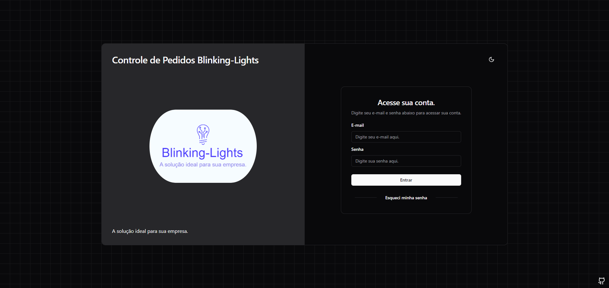
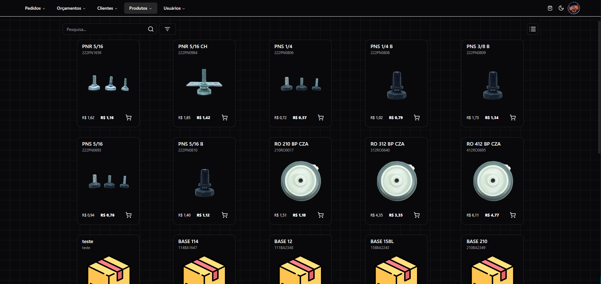
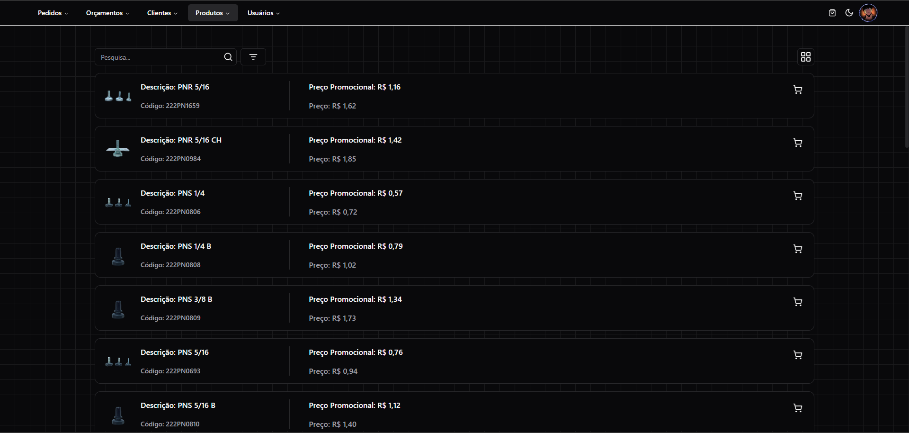
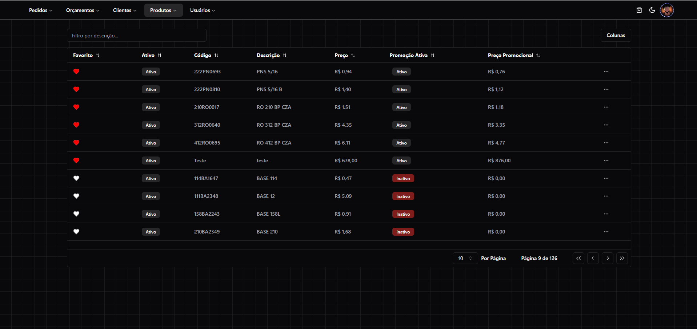
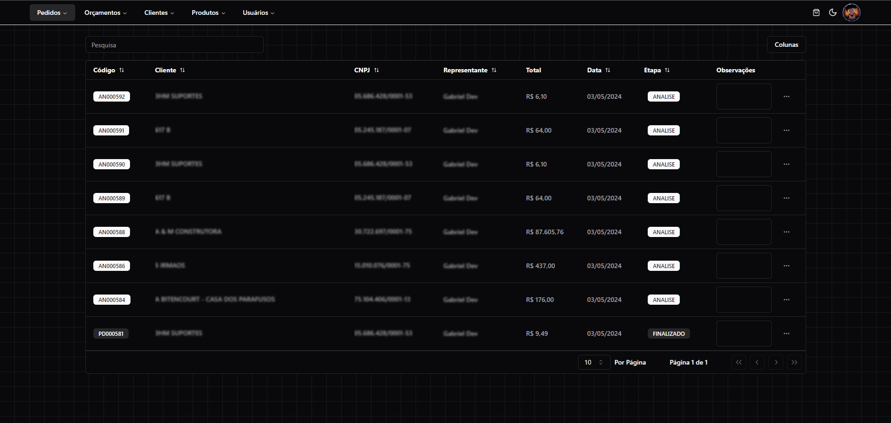
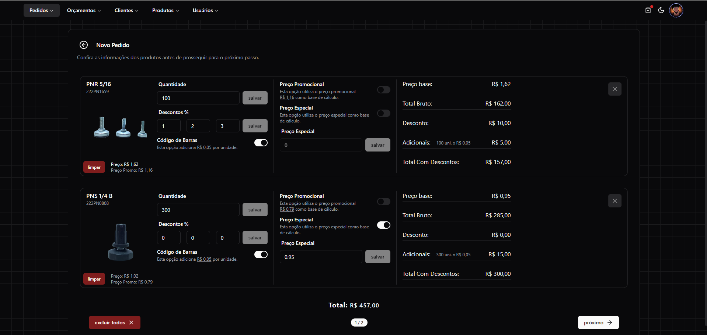
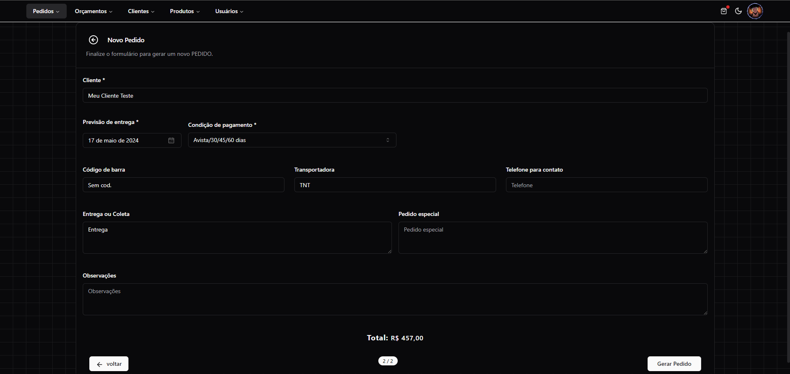
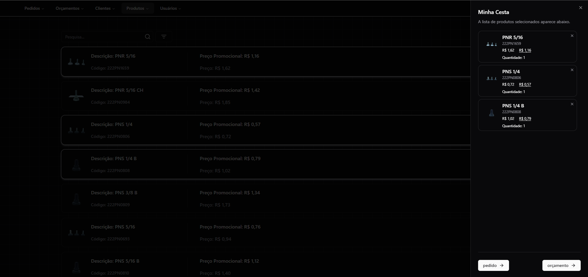
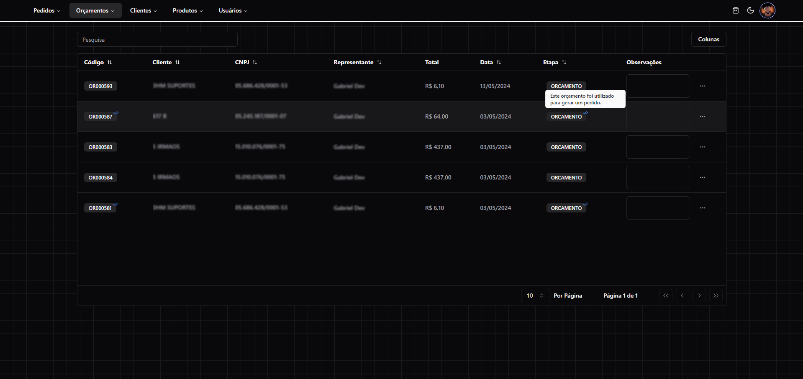
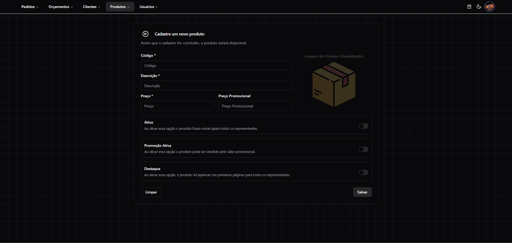
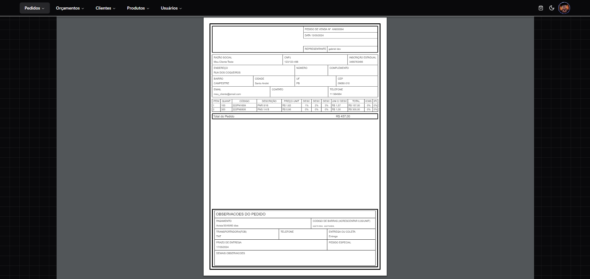